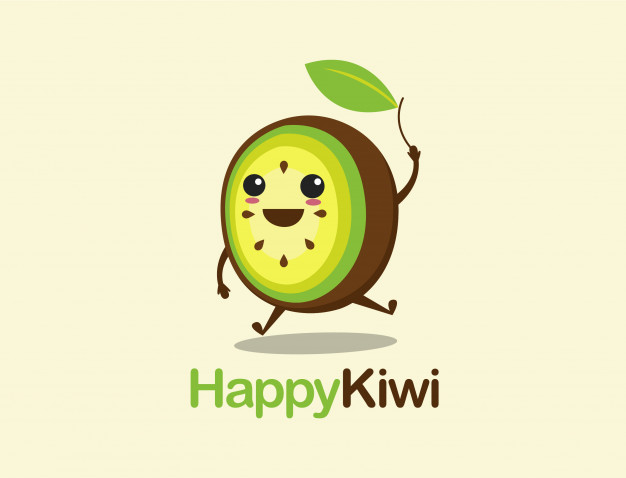

class: inverse, top, center
background-image: url(archivos/kiwi-fondo.png)
background-size: cover

```{r setup, include=FALSE}
knitr::opts_chunk$set(fig.retina = 3, warning = FALSE, message = FALSE, echo = FALSE)
```


```{r metathis, echo=FALSE}
library(metathis)
meta() %>%
  meta_name("github-repo" = "r4hr/kiwiparcial2021") %>% 
  meta_social(
    title = "Encuesta KIWI de Sueldos de RRHH de LATAM",
    description = paste(
      "Respuestas parciales de la 2° Encuesta KIWI de Sueldos de RRHH de LATAM",
      "Desarrollado por R4HR Club de R para RRHH."
    ),
    url = "https://kiwi-parcial.netlify.app/",
    image = "https://github.com/r4hr/kiwiparcial2021/blob/main/archivos/kiwi-cover.png?raw=true",
    image_alt = paste(
      "Encuesta KIWI de Sueldos de RRHH de LATAM:", 
      "Respuestas parciales de algunas preguntas de la 2° Encuesta KIWI de Sueldos de RRHH de LATAM", 
      "Desarrollada por R4HR Club de R para RRHH"
    ),
    og_type = "website",
    og_author = "Sergio Garcia Mora",
    twitter_card_type = "summary_large_image",
    twitter_creator = "@sergiogarciamor",
    twitter_site = "@club_rrhh"
  )
```

```{r xaringanExtra-share-again, echo=FALSE}
xaringanExtra::use_share_again()
```


???

Image credit: [Designed by Freepik]("http://www.freepik.com")

---
# Quiénes somos

[R4HR Club de R para RRHH](https://r4hr.club) es una comunidad de aprendizaje de programación en R destinada para las personas que trabajan o quieran trabajar en Recursos Humanos de habla hispana.

Nuestro objetivo es acercar el mundo de ciencias de datos a nuestra profesión, adaptando el contenido a nuestras habilidades y conocimientos, y también siempre que podemos, usando datos relacionados con la gestión de personas, y en castellano, para hacer más accesible el aprendizaje.

Este es un proyecto que reúne a gente de Argentina, Perú, Chile, Paraguay, Uruguay, Panamá, USA, Francia, España, Ecuador, Colombia y cada vez a más y más profesionales de distintas latitudes se unen y contribuyen al proyecto.

Para más información sobre el Club de R leé [este post](https://r4hr.club/2020/09/23/el-club-de-r-para-rrhh/), o escribinos a [info@r4hr.club](mailto:info@r4hr.club).

---
# Quiénes somos
## La encuesta KIWI `r emo::ji("kiwi")` de Sueldos de RRHH para LATAM

Uno de los problemas en el aprendizaje de People Analytics es la falta de datasets para practicar, así que una decisión que tomamos fue el de generar nuestro propio dataset y de abrirlo para toda la comunidad.

Para hacer esta encuesta nos "inspiramos" en [SysArmy](https://sysarmy.com/blog/), una comunidad para las personas que trabajan en tecnología que además de organizar uno de los eventos más importantes de tecnología de Argentina, Nerdearla, también organizan una encuesta salarial dos veces por año.

Estas son las motivaciones detrás de esta encuesta. Tener nuestro propio dataset, compartir los resultados y los datos, para que todos los entusiastas de RRHH y de los datos cuenten con una fuente de datos para practicar.

> Si querés conocer la historia detrás del nombre de la encuesta, la podés [conocer aquí](https://r4hr.club/why-kiwi/).

---
background-color: "#5d6d7e" 
# Quiénes somos
## Organizadores
.pull-left[
`r emo::ji("woman_technologist")` [Alithu Castro](https://www.linkedin.com/in/alithucastro/)

`r emo::ji("woman_artist")` [Carla Cirone](https://www.linkedin.com/in/carla-cirone-0566b095/)

`r emo::ji("woman_technologist")` [Daniela García](https://www.linkedin.com/in/claudia-daniela-garcia-138b1a14b/)

`r emo::ji("man_singer")` [Santiago Lardone Quinodoz](https://www.linkedin.com/in/santiago-lardone-quinodoz-978588167/)

`r emo::ji("snake")` [Sebastián Lombraña](https://www.linkedin.com/in/santiago-lardone-quinodoz-978588167/)

`r emo::ji("metal")` [Sergio García Mora](https://www.linkedin.com/in/sergiogarciamora/)

`r emo::ji("woman_teacher")` [Yanel Paulette](https://www.linkedin.com/in/yanelpaulette/)
]

.pull-right[]
---
background-color: "#5d6d7e" 
# ¿Aún no completaste la encuesta?


.pull-left[
<br><br>
]

.pull-right[
<br><br><br><br>
### Completá la encuesta en [este link](https://bit.ly/kiwi2021)

<br>
### El tiempo aproximado para completarla es de 7'26" #chequeadísimo `r emo::ji("engineer")`

]

---
class: inverse, center, middle
# Respuestas parciales


El 30 de noviembre publicamos los resultados finales.

---
# Participación
## Respuestas por países


```{r carga, echo=FALSE, message=FALSE, warning=FALSE}
library(tidyverse)
library(googlesheets4)
library(gargle)
library(gt)
library(extrafont)
library(scales)
library(ggalt)
library(kableExtra)
library(wordcloud)
library(networkD3)

options(scipen = 999)

loadfonts(quiet = TRUE)

# Estilo de los gráficos
estilo <- theme(panel.grid = element_blank(),
                plot.background = element_rect(fill = "#fbfcfc"),
                panel.background = element_blank(),
                text = element_text(family = "Roboto"))

fuente <- "Fuente: Encuesta KIWI de Sueldos de RRHH para Latam"

colores <-  c("#8624F5", "#1FC3AA")

kiwi <- read_sheet("1aeuu9dVfN42EjyvbmhEcsf0ilSz2DiXU-0MpnF896ss")
kiwi21 <- read_sheet("1nhpqDWuJoWhiVj0rIaV51-SdfnSxTpbV3Vcd3iYmyTw")
# Tipo de cambio
tc <- read_sheet("194DbwO2TNmYkWU5Ru1m6UxuOCfXxuRlFcrWrP_JzGv8") %>% 
  select(pais, tipo_cambio)

paises <- kiwi21 %>% 
  select(pais = `País en el que trabajas`) %>% 
  mutate(cuenta = 1) %>% 
  group_by(pais) %>% 
  summarise(conteo = sum(cuenta)) %>% 
#  filter(conteo > 4) %>% 
  arrange(-conteo)

paises %>% 
  rename(País = pais,
         Cantidad = conteo) %>% 
  kbl() %>% 
  kable_paper("hover", full_width = F) %>% 
  scroll_box(height = "450px")
```
<br>
Recibimos un total de `r nrow(kiwi21)` respuestas `r emo::ji("party")`.

---
# Participantes

.pull-left[
En esta encuesta participan tanto trabajadores en relación de dependencia, como trabajadores freelancers.

La representación de ambos tipos de trabajadores es la siguiente:


]
.pull-right[
```{r tipo_trabajo}
trabajo_tipo <- kiwi21 %>% 
  count(Trabajo) %>% 
  mutate(porcentaje = n/sum(n)) %>% 
  arrange(-n)

# Acomoda el texto en renglones
trabajo_tipo$Trabajo <- str_wrap(trabajo_tipo$Trabajo, width = 13)

# Calculamos los límites superiores de cada rectángulo
trabajo_tipo$ymax <- cumsum(trabajo_tipo$porcentaje)

# Calculamos el límite inferior de cada porción
trabajo_tipo$ymin <- c(0, head(trabajo_tipo$ymax, n=-1))

# Calculamos la posición de la etiqueta
trabajo_tipo$posicion_etiqueta <- (trabajo_tipo$ymax + trabajo_tipo$ymin) / 2

# Creamos las etiquetas de cada porción
trabajo_tipo$etiqueta <- paste0(trabajo_tipo$Trabajo, # paste0 pega elementos
                             "\n Cant: ", 
                             trabajo_tipo$n)

ggplot(trabajo_tipo, aes(ymax=ymax, 
                         ymin=ymin, 
                         xmax=4, 
                         xmin=3, 
                         fill=Trabajo)) +
  geom_rect() +
  coord_polar(theta = "y") +
  xlim(c(2,4)) +
  theme_void() +             # Elimina fondos y referencias
  scale_fill_manual(values = c("#4E5667","#28877A")) +   # Define una escala de colores
  theme(legend.position = "none",
        plot.title.position = "plot",
        text = element_text(family = "Roboto") 
        ) + # Modifica posición leyendas y del título
  labs(title = "Respuestas según Tipo de Trabajo",
       fill = "Tipo de Trabajo", 
       caption = fuente) +
  geom_label(x = 3.5,
             aes(y = posicion_etiqueta,
                 label = etiqueta),
             size = 3, 
             color = "white",
             family = "Ubuntu")
```

]

---
# Comparación de sueldos de RRHH por países

.pull-left[

```{r sueldos_dolar, warning=FALSE, message=FALSE, echo=FALSE, dpi=300}


# Preparación de datos

sueldos_dolar <- kiwi21 %>% 
  filter(Trabajo !="Freelance") %>% 
  select(genero = `Identidad de Género`, 
         puesto = `¿En qué puesto trabajás?`,
         pais = `País en el que trabajas` ,
         sueldo_bruto = `¿Cuál es tu remuneración BRUTA MENSUAL en tu moneda local? (antes de impuestos y deducciones)`,
         tipo_contratacion = `Tipo de contratación`)


sueldos_dolar <- sueldos_dolar %>% 
  mutate(puesto = str_trim(puesto, side = "both")) %>% 
  filter(!puesto %in% c("-", "Desarrollador", "Inspección de calidad", "Técnico"))


# Agrego un multiplicador de sueldos para convertir los sueldos part time en full time
sueldos_dolar <- sueldos_dolar %>% 
  left_join(tc, by="pais") %>% 
  mutate(multiplicador = 1, #if_else(contrato == "Part time", 1.5, 1),
         sueldo = as.numeric(unlist(sueldo_bruto)),
         sueldo_ft = sueldo * multiplicador,
         sueldo_dolar = sueldo_ft/tipo_cambio,
         cuenta = 1)

# Estimamos percentiles 5 y 95 para usar valores más centrales
# podamos todo lo que esté fuera de ese rango

numericos <- funModeling::profiling_num(sueldos_dolar$sueldo_dolar)
poda_p05 <- numericos[1,6]
poda_p95 <- numericos[1,10]

mediana_pais <- sueldos_dolar %>% 
  filter(pais %in% c("Argentina", "Perú", "Costa Rica", "Bolivia", "Uruguay",  "Chile", "México"),
         between(sueldo_dolar, poda_p05, poda_p95)) %>% 
  group_by(pais) %>% 
  summarise(sueldop = list(mean_se(sueldo_dolar))) %>% 
  unnest(cols = c(sueldop))

sueldo_dolar_pais <- sueldos_dolar %>% 
  filter(pais %in% c("Argentina", "Perú", "Costa Rica", "Bolivia", "Uruguay",  "Chile", "México"), 
         between(sueldo_dolar, poda_p05 ,poda_p95))
  

# Gráfico

ggplot(mediana_pais, aes(reorder(pais, -y), y =  y))+
  geom_col(fill = "#344D7E", alpha = 0.85) +
  geom_errorbar(aes(ymin = ymin,ymax = ymax), position = "dodge", color = "#333e47")+
  geom_point(data = sueldo_dolar_pais, aes(x = pais, y = sueldo_dolar), 
             alpha = 0.3, size = 2, color = "#75838F")+
  geom_text(aes(label = comma(round(x=y, 0), big.mark = ".", 
                              decimal.mark = ","),
                vjust = 1.5, fontface = "bold"), 
            size = 4, color = "white",
            family = "Roboto")+
  scale_y_continuous(labels = comma_format(big.mark = ".", decimal.mark = ","))+
  labs(title = "Salario promedio por país",
       subtitle = "Sueldos de RRHH en U$S",
       caption = paste0(fuente,"\nPaíses con más de 5 respuestas"),
       x = "", y = "") + 
  estilo

```

]

.pull-right[
**Aclaraciones:** 
1. Los resultados **no son representativos en absoluto** dada la baja cantidad de respuestas (cada punto representa una respuesta).
2. Para la comparación de los sueldos en dólares estadounidenses tomamos el tipo de cambio de cada país al 29 de octubre de 2021 publicados por los respectivos bancos centrales.
3. Sólo mostramos resultados de los países con al menos 5 respuestas.
4. Podamos los sueldos para mostrar aquellos que están dentro de los percentiles 5 y 95.
]

---
# Representación de mujeres en puestos de liderazgo
## Participación según género

.pull-left[
```{r respuestas-genero, echo=FALSE, warning=FALSE, dpi=300, out.width="90%"}
diversidad <- kiwi21 %>% 
  filter(Trabajo !="Freelance") %>% 
  mutate(genero = fct_collapse(`Identidad de Género`,
                               "Mujer cis" = c("mujer", "Mujer", "Mujer heterosexual"),
                               "Hombre cis" = c("Hombre", "Hombre hetero. Que es cis?", "Hombre heterosexual")))

div <- diversidad %>% 
select(genero) %>% 
  mutate(genero = factor(genero, 
                         levels = c("Mujer cis", "Hombre cis", 
                                    "Prefiero no responder",
                                    "No binario", "Gay"))) %>% 
  group_by(genero) %>% 
  summarise (n = n()) %>% 
  mutate(freq = n/sum(n)) %>% 
  arrange(-n)

# Compute the cumulative percentages (top of each rectangle)
div$ymax <- cumsum(div$freq)

# Compute the bottom of each rectangle
div$ymin <- c(0, head(div$ymax, n=-1))

# Compute label position
div$labelPosition <- (div$ymax + div$ymin) / 2

# Compute a good label
div$label <- paste0(div$genero, "\n Cant: ", div$n)

# Make the plot
ggplot(div, aes(ymax=ymax, ymin=ymin, xmax=4, xmin=3, fill=genero)) +
  geom_rect() +
  coord_polar(theta="y") + 
  xlim(c(2, 4)) +
  scale_fill_manual(values = c("#8624F5", "#1FC3AA", "#FFD129", "#75838F", "#7583FF")) +
  theme_void() +
  theme(legend.position = "right",
        panel.background = element_blank(),
        text = element_text(family = "Roboto")) +
  labs(title = "Cantidad de respuestas según identidad de género",
       fill = "Género", 
       caption = fuente)
```

]

.pull-right[
```{r genero-tabla, echo=FALSE}
gt(div %>% select(genero, n, freq)) %>% 
  tab_header(title = "Cantidad de respuestas según género") %>% 
  tab_source_note(source_note = fuente) %>% 
  fmt_percent(columns = "freq", decimals = 1) %>% 
  cols_label(genero = "Género",
             n = "Cantidad",
             freq = "Porcentaje") %>% 
    cols_align(align = "center", 
               columns = vars(n, freq))

```

]

---
# Representación de mujeres en puestos de liderazgo
## Participación según género

.pull-left[

```{r genero-lider, echo=FALSE, message=FALSE, warning=FALSE, results="hide"}
lideres <- diversidad %>% 
 select(puesto = `¿En qué puesto trabajás?`,
        genero = `Identidad de Género`,
         equipo = "¿Cuántas personas tenés a cargo? (poné 0 si no tenés gente a cargo?)") %>% 
  filter(!puesto %in% c("-", "Desarrollador", "Inspección de calidad", "Técnico"))


# Propoción de líderes hombres y mujeres
lideres_genero <- lideres %>% 
  filter(genero %in% c("Hombre cis","Mujer cis")) %>% 
  group_by(genero) %>%
  mutate(gente_a_cargo = if_else(puesto %in% c("Responsable", "Jefe", "Gerente", "Supervisor", "Director", "coordinación", "Coordinadora", "Superintendente"),1,0)) %>%
  summarise(lider = sum(gente_a_cargo)) %>% 
  left_join(div) %>% 
  select(genero, lider, n) %>% 
  mutate(proporcion = percent(lider/n))

# Test de hipótesis para validar diferencias de resultados
# Hay que verificar si la proporción de líderes hombres es mayor que la proporción de líderes mujeres

# Creo un dataframe para analizar proporciones de hombres y de mujeres en puestos de liderazgo y de no-liderazgo
test_lider <- lideres_genero %>% 
  mutate(no_lider = n - lider) %>%        # Columna de no líderes
  select(genero, lider, no_lider) %>%     # selecciono columnas de interés
  pivot_longer(cols = c(lider, no_lider), # Hago un dataset largo para analizar después
               names_to = "es_lider", values_to = "conteo")

# Del total de respuestas me interesa sólo ver cuáles son los hombres con puesto de liderazgo
test_lider$cat <- c(1,0,0,0)

# Extraigo el mu para decidir si la diferencia es significativa y pasarlo a la fórmula del test.
prop_mujer_lid <- pull(lideres_genero[2,2]/lideres_genero[2,3])

# Realizo el test de hipótesis.
# H0 = Las proporciones de líderes hombres y mujeres son iguales
# H1 = La proporción de hombres líderes es mayor que la proporción de mujeres líderes.
resultados_test <- broom::tidy(t.test(test_lider$cat, mu = prop_mujer_lid, alternative = "greater"))


valor_test <- if(resultados_test[1,3] > 0.05) {
  print("la diferencia es estadísticamente significativa, y la proporción de hombres en puestos de liderazgo es mayor que el de las mujeres")
  } else {
    print("la diferencia no es estadísticamente significativa, y la proporción de hombres no es estadísticamente mayor que el de las mujeres en puestos de liderazgo")
  }
```

De acuerdo a las respuestas recolectadas **2 de cada 3** participantes son mujeres.

Para los puestos de liderazgo consideramos las personas en los puestos de *Gerente*, *Jefe*, *Responsable*, y *Supervisor*.

Del total de **mujeres**, `r lideres_genero[2,3]` respuestas, `r lideres_genero[1,2]` ocupan un puesto de liderazgo (`r lideres_genero[2, 4]`).

Del total de **hombres**, `r lideres_genero[1, 3]` respuestas, `r lideres_genero[2,2]` ocupan un puesto de liderazgo (`r lideres_genero[1, 4]`).

Con un *p-value* igual a `r round(resultados_test[1,3],3)` podemos afirmar que **`r valor_test`**.
]

.pull-right[
```{r genero-lideres-plot, echo=FALSE, dpi=300}
# Gráfico
lideres_genero %>% 
  mutate(porc_lider = lider/n, 
         porc_no_lider = 1 - porc_lider) %>% 
  pivot_longer(cols = c(porc_lider, porc_no_lider),
               names_to = "es_lider", 
               values_to = "valores") %>% 
  mutate(es_lider = factor(es_lider, 
                           levels = c("porc_no_lider", "porc_lider"), 
                           labels = c("No Líder", "Líder"))) %>% 
  ggplot(aes(x= genero, y = valores, fill = es_lider))+
  geom_col(position = "fill")+
  estilo +
  scale_fill_manual(values = c("#75838F", "#344D7E")) +
  labs(title = "Proporción de Líderes según género",
       x = "", y = "", fill = "", 
       caption = fuente)
```

]

---
# Brecha salarial entre hombres y mujeres

.pull-left[
```{r brecha, echo=FALSE, dpi=300}
liderazgo <- kiwi21 %>% 
  select(`Identidad de Género`, `¿En qué puesto trabajás?`,`País en el que trabajas` ,`¿Cuál es tu remuneración BRUTA MENSUAL en tu moneda local? (antes de impuestos y deducciones)`)

names(liderazgo) <- c("genero", "puesto","pais", "sueldo")

liderazgo <- liderazgo %>% 
  filter(!is.na(puesto)) %>% 
  mutate(sueldo = as.numeric(unlist(sueldo)),
         cuenta = 1) %>% 
  filter(pais == "Argentina")


brecha <- liderazgo %>% 
  filter(genero %in% c("Mujer cis", "Hombre cis"), 
         puesto %in% c("Gerente","Jefe", "HRBP","Responsable", "Analista", "Administrativo")) %>% 
  mutate(puesto = factor(puesto, levels = c("Administrativo","Analista",                                          "HRBP", "Responsable", "Jefe",                                            "Gerente","Director" ))) %>% 
  select(-pais) %>% 
  group_by(genero, puesto) %>% 
  summarise(media_salarial = mean(sueldo))


brecha_graf <- brecha %>% 
  pivot_wider(., names_from = genero, values_from = media_salarial) %>% 
  mutate(brecha = percent((`Hombre cis`-`Mujer cis`)/`Hombre cis`, 1),
         x = (`Hombre cis` + `Mujer cis`)/2)

ggplot(brecha_graf, 
       aes(x = `Mujer cis`, xend = `Hombre cis`, y = puesto, 
           group = puesto, label = brecha)) +
  geom_dumbbell(color = "#808080",
                size_x = 3, size_xend = 3,
                colour_x = colores[1],
                colour_xend = colores[2]) +
  geom_text(data = brecha_graf, 
            aes(x, puesto, label = brecha), size =3,
            nudge_y = .2) +
  labs(title = "Brecha salarial por puestos de RRHH",
       subtitle = "Sueldos promedios en Argentina",
       x = "",
       y = NULL, 
       caption = fuente) +
  scale_x_continuous(labels = comma_format(big.mark = ".", decimal.mark = ",")) +
  scale_color_manual(values = colores) +
  theme_minimal()+
  theme(plot.background = element_rect(fill = "#fbfcfc"),
        text = element_text(family = "Roboto"))
```
]

.pull-right[
En los únicos casos en que las mujeres tienen un sueldo promedio más alto que los hombres son en los puestos de *Gerente* y de *Analista* de acuerdo a la muestra recolectada por nuestra encuesta.

Agradecemos a [Natsumi Shokida](https://twitter.com/NatsuSh) por permitirnos replicar el gráfico de *"Brecha de ingresos mensuales por calificación del puesto de trabajo"* del informe ["La desigualdad de género se puede medir"](https://ecofeminita.github.io/EcoFemiData/informe_desigualdad_genero/trim_2019_03/informe.nb.html#) que realizan para Economía Femini(s)ta.

]

---
# Preguntas Random
## "¿Pensás tener hijos?"/"¿Por qué no estás casada?"

.pull-left[
Cuando diseñamos esta encuesta, nos pareció una buena idea preguntar sobre cuáles fueron las preguntas más desubicadas o bizarras realizadas en una entrevista laboral.

En esta edición de la Encuesta nos sorprendió la diversidad de respuestas sobre temas relacionados a la familia. 

```{r biz}
preg <- kiwi21[,c(2,37)] 

names(preg) <- c("genero", "pregunta")

preg <- preg %>% 
  mutate(genero = fct_collapse(genero, "Mujer cis" = "Mujer"))

listado_preg <- preg %>% 
  filter(str_detect(pregunta, "hijo[s]")|
           str_detect(pregunta, "familia")|
           str_detect(pregunta, "divorcié")|
           str_detect(pregunta, "embaraz[aoarte]")|
           str_detect(pregunta, "madre")|
           str_detect(pregunta, "pareja")|
           str_detect(pregunta, "quién vivo")|
           str_detect(pregunta, "matrimonio")|
           str_detect(pregunta, "casad[aoe]|casar")| 
           str_detect(pregunta,"novio")|
           str_detect(pregunta, "gay"))
```

En el listado de preguntas impresentables la peor de todas fue:
> **`r listado_preg[11,2]`** `r emo::ji("scream")`

]

.pull-right[
Estas fueron algunas de las palabras que tuvimos que filtrar para este análisis.

```{r biz2,echo=TRUE, eval=FALSE}
listado_preg <- preg %>% 
  filter(str_detect(pregunta, "hijo[s]")|
           str_detect(pregunta, "familia")|
           str_detect(pregunta, "divorcié")|
           str_detect(pregunta, "embaraz[aoarte]")|
           str_detect(pregunta, "madre")|
           str_detect(pregunta, "pareja")|
           str_detect(pregunta, "quién vivo")|
           str_detect(pregunta, "matrimonio")|
           str_detect(pregunta, "casad[aoe]|casar")| 
           str_detect(pregunta,"novio")|
           str_detect(pregunta, "gay"))
```
]

---
# Preguntas Random
## "¿Pensás tener hijos?"/"¿Por qué no estás casada?"

.pull-left[Al respecto quisimos saber a cuántas mujeres y hombres les habían hecho preguntas desubicadas sobre si tendrían hijos, o si tenían planes de casamiento. En `r nrow(listado_preg)` respuestas esto es lo que encontramos:
```{r bizar, echo = FALSE}
gt(preg %>% 
  filter(str_detect(pregunta, "hijo[s]")|
           str_detect(pregunta, "familia")|
           str_detect(pregunta, "divorcié")|
           str_detect(pregunta, "embaraz[aoarte]")|
           str_detect(pregunta, "madre")|
           str_detect(pregunta, "pareja")|
           str_detect(pregunta, "quién vivo")|
           str_detect(pregunta, "matrimonio")|
           str_detect(pregunta, "casad[aoe]|casar")| 
           str_detect(pregunta,"novio")|
           str_detect(pregunta, "gay")) %>% 
  group_by(genero) %>% 
  summarise (n = n()) %>% 
  mutate(freq = percent(n/sum(n)))) %>% 
  cols_label(genero = "Género", 
             n = "Cantidad",
             freq = "Porcentaje")
```
]

.pull-right[
```{r bizar-plot, echo=FALSE, out.width="85%", dpi=300}
preg %>% 
  filter(genero != "No binario",
         str_detect(pregunta, "hijo[s]")|
           str_detect(pregunta, "familia")|
           str_detect(pregunta, "divorcié")|
           str_detect(pregunta, "embaraz[aoarte]")|
           str_detect(pregunta, "madre")|
           str_detect(pregunta, "pareja")|
           str_detect(pregunta, "quién vivo")|
           str_detect(pregunta, "matrimonio")|
           str_detect(pregunta, "casad[aoe]|casar")| 
           str_detect(pregunta,"novio")|
           str_detect(pregunta, "gay")) %>% 
  group_by(genero) %>% 
  summarise (n = n()) %>% 
  mutate(freq = percent(n/sum(n))) %>% 
  ggplot(aes(x = genero, y = n, fill = genero)) +
  geom_col() +
  scale_fill_manual(values = c("#FFD129", "#1FC3AA", "#8624F5","#75838F")) +
  estilo + theme(legend.position = "none") +
  labs(title = "Personas a las que les preguntaron si pensaban tener hijos\no si planeaban casarse en una entrevista laboral",
       x = "", y= "", fill = "",
       caption = fuente)
```

]

---
# Retorno a las oficinas

En esta oportunidad estamos relevando si la decisión de retornar a la oficina es de común acuerdo o de manera unilateral de parte de la empresa o de las personas, y analizar el nivel de satisfacción.

.center[
```{r retorno, out.width="65%"}
covid <- kiwi21[,c(51,54)]

#var_original <- names(covid)

names(covid) <- c("decision", "satisfaccion")


covid <- covid %>% 
  filter(!is.na(satisfaccion),
         decision != "No aplica")


covid <- covid %>% 
  group_by(decision, satisfaccion) %>% 
  tally()

nodes <- data.frame(
  name = c(as.character(covid$decision),
           as.character(covid$satisfaccion)) %>% 
    unique()
)


covid$id_source <- match(covid$decision, nodes$name) - 1
covid$id_target <- match(covid$satisfaccion, nodes$name) -1

# prepare color scale: I give one specific color for each node.
my_color <- 'd3.scaleOrdinal() .domain(["De común acuerdo", "De la empresa","Del empleado", 
"Algo insatisfecho", "Algo satisfecho", "Muy insatisfecho", "Muy satisfecho", "No aplica / Prefiero no responder"])
.range(["blue", "purple" , "orange", "orange", "gray", "yellow", "purple", "purple"])'


covid <- covid %>%
  mutate(satisfaccion = factor(satisfaccion,
                           levels = c("No aplica / Prefiero no responder", "Muy instatisfecho",
                                      "Algo insatisfecho", "Algo satisfecho", "Muy satisfecho")))


p <- sankeyNetwork(Links = covid, Nodes = nodes,
                   Source = "id_source", Target = "id_target",
                   colourScale = my_color, fontSize = 8, fontFamily = "Roboto",
                   Value = "n", NodeID = "name", sinksRight = TRUE,
                   height = 420)
p


```
]

---
# ¿Cómo se llama el área?

.pull-left[
```{r nombre-area-plot, echo=FALSE, dpi=300}
nombres <- kiwi21[ , 31]

nombres <- nombres %>%
  rename(nombre = `¿Cómo se llama el área en tu empresa?`) %>%
  filter(!is.na(nombre))

distintos <- distinct(.data = nombres) %>% count() %>% pull()

nombres <- nombres %>%
  mutate(nombre = str_to_title(nombre, locale = "es")) %>%
  group_by(nombre) %>%
  count(sort = T, name = "rtas") %>%
  head(10) %>%
  ungroup()
 

# ggplot(nombres, aes(x = rtas, y = reorder(nombre,rtas))) +
#   geom_col(fill = "#344D7E") +
#   estilo +
#   labs(title = "Top 10 de nombres para el área de RRHH",
#        x = "", y = "", caption = fuente) +
#   theme(plot.title.position = "plot")

# Nube de palabras
nombre <- kiwi21[,31]

nombre <- nombre %>%
  rename(area = `¿Cómo se llama el área en tu empresa?`) %>% 
  filter(!is.na(area)) %>% 
  mutate(area = str_replace(area, "Adm. De personal", "Administración de Personal"),
         area = str_replace(area, "GESTION DE DESARROLLO HUMANO", "Gestión de Desarrollo Humano" ),
         area = tolower(area))

nombre <- nombre %>% 
tidytext::unnest_tokens(word, area)

nombre <- nombre %>% 
  group_by(word) %>% 
  tally(sort = T) 

set.seed(99)
wordcloud(words = nombre$word, freq = nombre$n, random.order = F,
           rot.per = 0.35, scale= c(7.5, 1.8), family = "Roboto", 
           colors=brewer.pal(8, "Dark2"))


rm(nombre)
```

]

.pull-right[

En total, encontramos `r distintos` formas diferentes de llamar al área. En comparación con la edición del año pasado, el nombre *Oficina De Personal* tiene menos protagonismo.


```{r nombre-area-tabla, echo=FALSE, out.width="70%"}
gt(nombres) %>%
  cols_label(nombre = "Nombre del Área",
             rtas = "Respuestas") %>%
  tab_style(style = list(
    cell_fill = "#F8FF00"),
    locations = cells_body(
      columns = vars(nombre),
      rows = nombre == "Oficina De Personal"
    ))
```
]

---
class: inverse, center, middle

## Seguinos en nuestras redes
### [link.tree/r4hrclub](https://www.linktr.ee/r4hrclub) `r emo::ji("satellite")`


---

# Paquetes utilizados

* [ggplot2](https://ggplot2.tidyverse.org): H. Wickham. ggplot2: Elegant Graphics for Data Analysis. Springer-Verlag New York, 2016.
* [tidyverse](https://doi.org/10.21105/joss.01686): Wickham et al., (2019). Welcome to the tidyverse. Journal of Open Source Software, 4(43), 1686
* [funModeling](https://CRAN.R-project.org/package=funModeling): Pablo Casas (2020). funModeling: Exploratory Data Analysis and Data Preparation Tool-Box. R package version 1.9.4.
* [ggalt](https://CRAN.R-project.org/package=ggalt): Bob Rudis, Ben Bolker and Jan Schulz (2017). ggalt: Extra Coordinate Systems, 'Geoms', Statistical Transformations, Scales and Fonts for 'ggplot2'. R package version 0.4.0.
* [gargle](https://CRAN.R-project.org/package=gargle): Jennifer Bryan, Craig Citro and Hadley Wickham (2020). gargle: Utilities for Working with Google APIs. R package version 0.5.0.
* [googlesheets4](https://CRAN.R-project.org/package=googlesheets4): Jennifer Bryan (2020). googlesheets4: Access Google Sheets using the Sheets API V4. R package version 0.2.0.
* [gt](https://CRAN.R-project.org/package=gt): Richard Iannone, Joe Cheng and Barret Schloerke (2020). gt: Easily Create Presentation-Ready Display Tables. R package version 0.2.2.
* [scales](https://CRAN.R-project.org/package=scales): Hadley Wickham and Dana Seidel (2020). scales: Scale Functions for Visualization. R package version 1.1.1.
* [extrafont](https://CRAN.R-project.org/package=extrafont): Winston Chang, (2014). extrafont: Tools for using fonts. R package version 0.17.
---
class: inverse, center, bottom

Muchas gracias a [Ivana Feldfeber](https://www.linkedin.com/in/ivana-feldfeber/) del [Observatorio de Datos con Perspectiva de Género](https://sites.google.com/view/datagenero) por la paciencia y el asesoramiento en las definiciones sobre las preguntas de Identidad de Género y las relacionadas con diversidad.

Presentación realizada con el paquete [Xaringan](https://github.com/yihui/xaringan) desarrollado por Yihui Xie.

Gracias a [Patricia Loto](https://twitter.com/patriloto) por compartir el [tutorial](https://twitter.com/patriloto/status/1260822644590608391?s=20)

